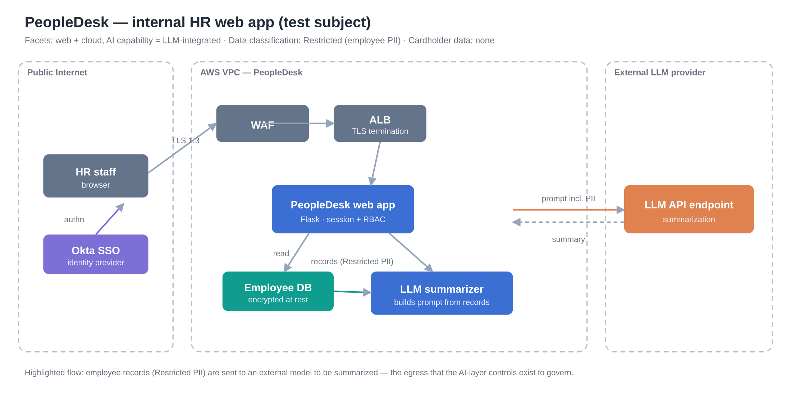

# PeopleDesk — test subject

A small, deliberately representative application used to exercise the engine
end to end. It is the canonical example referenced throughout the test suite
(`tests/test_pipeline.py`).



## What it is

PeopleDesk is an **internal HR web application** deployed on AWS. HR staff sign
in through **Okta SSO**. The **employee database is encrypted at rest** and all
traffic uses **TLS 1.3**; a **WAF** fronts the app behind an ALB. The
distinguishing feature is an **LLM summarizer**: on request, the app pulls an
employee's records and asks an **external model endpoint** to summarize them.

## Why this subject

It sits exactly at the altitude this tool targets. The web/cloud plumbing is
mostly sound, so a generic web threat model would say "looks fine." The
interesting exposure is the **AI egress**: Restricted employee PII leaving the
trust boundary to a third-party model. That is what the AI-layer controls
(prompt-injection defense, data minimization, no-retention endpoint, output
filtering, authorization scoping, rate limiting, LLM logging) exist to govern —
and it is precisely what the facet-aware catalog pulls in once you declare the
app as **LLM-integrated**.

## Facets (the tool's inputs)

| Field | Value |
|---|---|
| Platforms | web, cloud |
| AI capability | `llm` (LLM-integrated) |
| Data classification | Restricted (employee PII) |
| Handles cardholder data | No → PCI out of scope |

## Evidence supplied to the tool

* **Description** (the paragraph above) — the text detector recognises SSO,
  encryption-at-rest, TLS and WAF and marks them *implemented* (low confidence).
* **Declaration** — the architect declares the AI controls **not present**
  (`AI-PI-001`, `AI-ENDP-001`, `AI-OUT-001`, `AI-RATE-001`, `AI-LOG-001`).
* **Out-of-catalog** — "PII display tokenization" (masks identifiers on screen
  after the model call); the engine recognises it as a compensating
  InformationDisclosure control and flags it as a catalog candidate.

## Expected result (what the tests assert)

* The declared-absent **AI controls surface as findings**, with threats and
  DREAD scores (Restricted data + missing controls ⇒ at least one Critical/High).
* The **described controls are not findings** (SSO, encryption, TLS, WAF).
* Web controls that were **neither described nor declared** (CSRF, session,
  headers, secrets…) become **clarifications, not findings** — unknown ≠ missing.
* **PCI section is out of scope** (no cardholder data).
* **Tokenization** appears as a compensating control and a catalog candidate.

Run it yourself with the example intake:

```bash
python -m threatcatalog.cli testapp/peopledesk_intake.json --out /tmp/peopledesk.md
```
